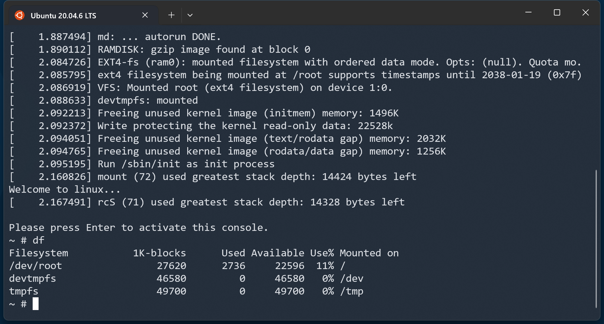
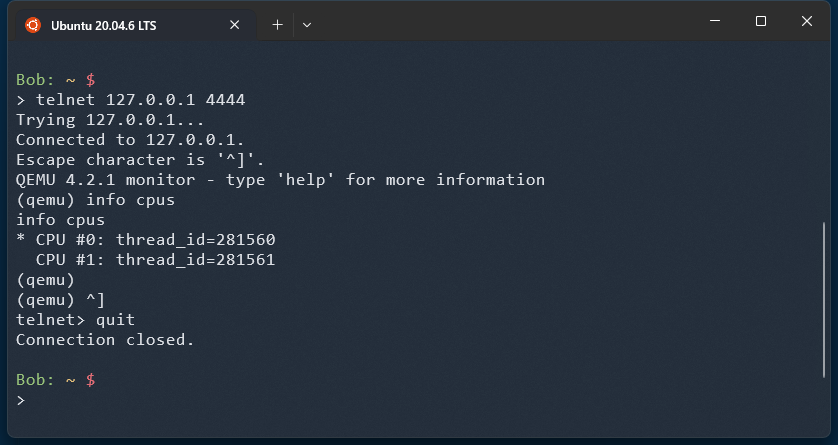

# Kardel Linux

Kardel Linux 是一个微型 Linux 发行版，命名来自 Dota2 游戏的矮人火枪手：卡德尔·鹰眼（Kardel Sharpeye），目标是构建一个基于 busybox 和 musl 的最简 Linux 发行版，并探索 Linux 系统的基本概念。

文件说明：

1. config.sh 配置了一些公用的变量，其他脚本会调用它，来确定文件读写的路径。
2. build-kernel.sh 将内核源码下载到 `${DOWNLOAD_DIR}` 下面，然后解压到 `${BUILD_DIR}` 下编译，生成的内核文件安装到 `${INSTALL_DIR}` 路径下。
3. build-busybox.sh 将 Busybox 的源码下载到 `${DOWNLOAD_DIR}` 下面，然后解压到 `${BUILD_DIR}` 下编译，生成的基础 rootfs 安装到 `${INSTALL_DIR}` 路径下。
4. build-image.sh 会从 `${INSTALL_DIR}` 路径获取制作系统镜像所需的文件，在 `${IMAGE_DIR}` 路径下完成制作。
5. run.sh 会使用 `${IMAGE_DIR}` 下的系统镜像文件，启动一个 Qemu 虚拟机。

更多内容参考 `docs/` 下的文档。

使用方法是依次执行如下脚本：

```
$ ./build-kernel.sh
$ ./build-busybox.sh
$ ./build-image.sh
$ ./run.sh
```

启动成功：



可以执行 `poweroff` 命令关机，如果要直接关闭 Qemu 虚拟机，可以按下组合键`Ctrl+a`，然后按 `x` 键。

Qemu 虚拟机添加了 `-monitor tcp:127.0.0.1:4444` 选项，可以用 telnet 连接虚拟机的监视器，查看虚拟机的配置和状态，例如：



注意，按下 `Ctrl+]` 组合键可以只退出监视器而不关闭虚拟机。