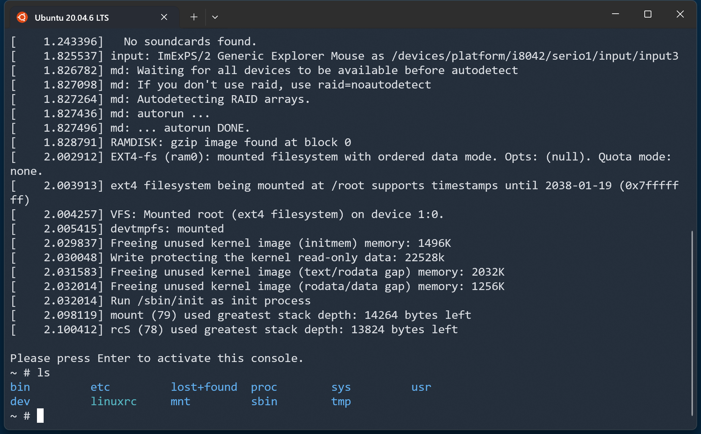

# Kardel Linux

Kardel Linux 是一个微型 Linux 发行版，命名来自 Dota2 游戏的矮人火枪手：卡德尔·鹰眼（Kardel Sharpeye），目标是构建一个基于 busybox 和 musl 的最简 Linux 发行版，并探索 Linux 系统的基本概念。

目前支持如下内核版本，编译内核时可以选择：
1. linux-6.6.106
2. linux-5.15.193

在 Ubuntu20.04 和 Ubuntu24.04 系统验证通过。

文件说明：

1. config.sh 配置了一些公用的变量，其他脚本会调用它，来确定文件读写的路径。
2. busy-uboot.sh 将u-boot源码下载到 `${DOWNLOAD_DIR}` 下面，然后解压到 `${BUILD_DIR}` 下编译，生成的 bootloader 安装到 `${INSTALL_DIR}` 路径下。
3. build-kernel.sh 将内核源码下载到 `${DOWNLOAD_DIR}` 下面，然后解压到 `${BUILD_DIR}` 下编译，生成的内核文件安装到 `${INSTALL_DIR}` 路径下。
4. build-busybox.sh 将 Busybox 的源码下载到 `${DOWNLOAD_DIR}` 下面，然后解压到 `${BUILD_DIR}` 下编译，生成的基础 rootfs 安装到 `${INSTALL_DIR}` 路径下。
5. build-image.sh 会从 `${INSTALL_DIR}` 路径获取制作系统镜像所需的文件，复制到 `${IMAGE_DIR}` 路径下，完成制作，主要进一步制作 rootfs 。
6. run.sh 会使用 `${IMAGE_DIR}` 下的系统镜像文件，启动一个 Qemu 虚拟机。

## 快速开始

以 Ubuntu20 宿主机为例，使用前需要安装 qemu 虚拟机：

```
$ sudo apt-get install qemu-system
$ qemu-system-x86_64 --version
QEMU emulator version 4.2.1 (Debian 1:4.2-3ubuntu6.30)
Copyright (c) 2003-2019 Fabrice Bellard and the QEMU Project developers
```

安装一些必要的包：
```
$ sudo apt-get install git cmake build-essential bison flex swig python3-dev \
libssl-dev libncurses-dev libelf-dev bc zstd libtirpc-dev rpcbind libnsl-dev pkgconf
```

然后依次执行如下脚本生成所需的组件：

```
$ ./build-uboot.sh
$ ./build-kernel.sh
$ ./build-busybox.sh
$ ./build-image.sh
```

可以执行 `./run.sh -s` 直接启动 kernel 和 rootfs，无需 u-boot。如果要完整启动，需要用 `-u` 选项：

```
$ ./run.sh -u
```

使用 `-u` 选项可以让 Qemu 虚拟机先启动 u-boot，然后 u-boot 会加载 kernel 和 rootfs 到内存，并启动：

```
U-Boot 2024.04 (Jan 05 2025 - 10:51:33 +0800)

CPU:   QEMU Virtual CPU version 2.5+
DRAM:  1 GiB
Core:  20 devices, 13 uclasses, devicetree: separate
Loading Environment from nowhere... OK
Video: 1024x768x0
Model: QEMU x86 (I440FX)
Net:   e1000: 52:54:00:12:34:56
       eth0: e1000#0
Hit any key to stop autoboot:  0
loading kernel to address 1000000 size a067a0 initrd 4000000 size 16b2dc
Valid Boot Flag
Magic signature found
Linux kernel version 5.15.175 (lsc@Bob) #1 SMP Sun Jan 5 10:55:23 CST 2025
Building boot_params at 0x00090000
Loading bzImage at address 100000 (10512288 bytes)
Initial RAM disk at linear address 0x04000000, size 1487580 bytes
Kernel command line: "root=/dev/ram rw rootfstype=ext4 console=ttyS0 init=/sbin/init"
Kernel loaded at 00100000, setup_base=0000000000090000

Starting kernel ...
```

启动成功后，按下回车可以进入命令行提示符：



可以执行 `poweroff` 命令关机，如果要直接关闭 Qemu 虚拟机，可以按下组合键`Ctrl+a`，然后按 `x` 键。

该虚拟机添加了 `-monitor tcp:127.0.0.1:4444` 选项，可以用 `telnet 127.0.0.1 4444` 连接虚拟机的监视器，查看虚拟机的配置和状态，例如：


注意，按下 `Ctrl+]` 组合键可以只退出监视器而不关闭虚拟机，如果执行 q 命令，会关闭虚拟机。

> 更多内容参考 `docs/` 下的文档。

## 使用方法

### 文件共享

虚拟机使用9P文件系统，将主机的`HOST_SHARE_PATH=${BUILD_DIR}`路径挂载到了虚拟机的 `/mnt` 目录：

```
~ # df
Filesystem           1K-blocks      Used Available Use% Mounted on
/dev/root                27620      2736     22596  11% /
devtmpfs                495340         0    495340   0% /dev
tmpfs                   498436         0    498436   0% /tmp
hostshare            1055762784  78147900 923911352   8% /mnt
~ # cd /mnt/
/mnt # ls
busybox-1.36.1   install          u-boot-v2024.04
image            linux-5.15.193
```

可以用这个路径，实现虚拟机和主机的文件共享。

### 网络

虚拟机使能了一个以太网卡：

```
~ # ifconfig
eth0      Link encap:Ethernet  HWaddr 52:54:00:12:34:56
          inet addr:10.0.2.15  Bcast:10.0.2.255  Mask:255.255.255.0
          inet6 addr: fe80::5054:ff:fe12:3456/64 Scope:Link
          inet6 addr: fec0::5054:ff:fe12:3456/64 Scope:Site
          UP BROADCAST RUNNING MULTICAST  MTU:1500  Metric:1
          RX packets:3 errors:0 dropped:0 overruns:0 frame:0
          TX packets:9 errors:0 dropped:0 overruns:0 carrier:0
          collisions:0 txqueuelen:1000
          RX bytes:742 (742.0 B)  TX bytes:1782 (1.7 KiB)

lo        Link encap:Local Loopback
          inet addr:127.0.0.1  Mask:255.0.0.0
          inet6 addr: ::1/128 Scope:Host
          UP LOOPBACK RUNNING  MTU:65536  Metric:1
          RX packets:0 errors:0 dropped:0 overruns:0 frame:0
          TX packets:0 errors:0 dropped:0 overruns:0 carrier:0
          collisions:0 txqueuelen:1000
          RX bytes:0 (0.0 B)  TX bytes:0 (0.0 B)
```

在 QEMU 的用户模式网络中，10.0.2.2 是宿主机的 IP 地址：

```
~ # ping 10.0.2.2 -c 4
PING 10.0.2.2 (10.0.2.2): 56 data bytes
64 bytes from 10.0.2.2: seq=0 ttl=255 time=10.954 ms
64 bytes from 10.0.2.2: seq=1 ttl=255 time=1.067 ms
64 bytes from 10.0.2.2: seq=2 ttl=255 time=1.940 ms
64 bytes from 10.0.2.2: seq=3 ttl=255 time=1.988 ms

--- 10.0.2.2 ping statistics ---
4 packets transmitted, 4 packets received, 0% packet loss
round-trip min/avg/max = 1.067/3.987/10.954 ms
```

也可以联通公网：

```
~ # ping 223.5.5.5 -c 4
PING 223.5.5.5 (223.5.5.5): 56 data bytes
64 bytes from 223.5.5.5: seq=0 ttl=255 time=25.036 ms
64 bytes from 223.5.5.5: seq=1 ttl=255 time=15.167 ms
64 bytes from 223.5.5.5: seq=2 ttl=255 time=15.407 ms
64 bytes from 223.5.5.5: seq=3 ttl=255 time=15.573 ms

--- 223.5.5.5 ping statistics ---
4 packets transmitted, 4 packets received, 0% packet loss
round-trip min/avg/max = 15.167/17.795/25.036 ms
```